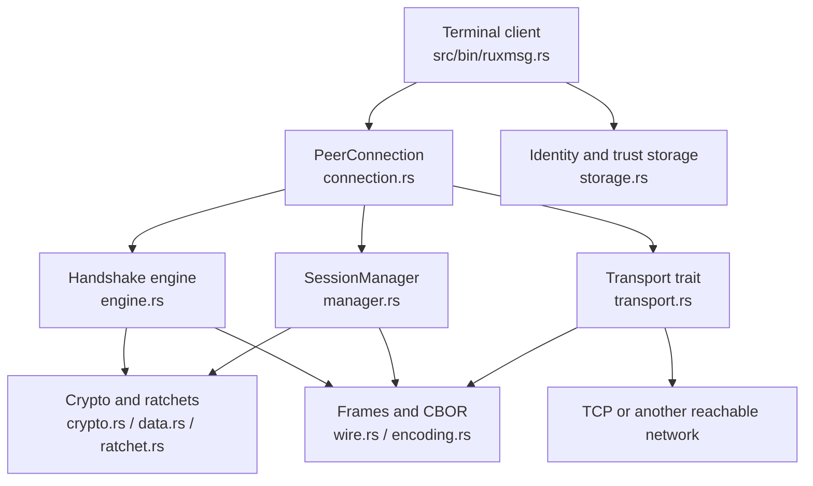

# RUXMSG architecture

This document explains how the implementation is organized. It is explanatory, not normative. For wire behavior and security requirements, see the [RUXMSG/1 protocol specification](../protocol-spec.md).

## System boundary

RUXMSG is a peer-to-peer encrypted messaging library and terminal client. The network is treated as hostile: TCP, Tailscale, or another transport provides reachability only. Cryptographic identity, authentication, confidentiality, integrity, and replay protection are provided above that transport.

## Layer responsibilities

### Identity and trust

`identity.rs` models the 32-byte Ed25519 public identity and peer records. `crypto::IdentityKeypair` owns the local private seed. `storage.rs` persists the identity seed and trust records through an operating-system credential store and an AEAD-sealed file.

Trust is an application decision. Receiving a public key does not automatically make it trusted. First contact requires an authenticated handshake and independent SAS comparison.

### Handshake and transcript

`handshake.rs` defines HELLO, signed handshake, and confirmation payloads. `encoding.rs` defines the transcript fields. `engine.rs` drives both roles over a `Transport`:

1. exchange fresh identity, ephemeral key, role, nonce, and purpose;
2. construct the deterministic transcript;
3. calculate and display the three-word SAS;
4. authenticate the transcript with Ed25519 signatures;
5. derive session keys with X25519 and HKDF;
6. exchange confirmation MACs;
7. return an established session only after confirmation succeeds.

The transcript excludes the signatures that authenticate it. This prevents signatures from changing the value being signed.

### Session and message protection

`manager.rs` owns the active session and, during rekey, an optional draining predecessor. `session.rs` enforces lifecycle transitions. `ratchet.rs` maintains directional chain state, replay windows, and bounded skipped keys. `data.rs` pads, encrypts, decrypts, and validates DATA payloads. `crypto.rs` contains the primitive composition and nonce/key derivation helpers.

Only the active session originates new DATA. A draining session can accept eligible in-flight DATA for the drain window but cannot send new DATA.

### Wire and transport

`wire.rs` implements the six-byte outer frame header and strict payload limits. CBOR payload validation rejects malformed, non-canonical, duplicate-key, unknown-key, and trailing-byte input according to the protocol contract.

`transport.rs` provides:

- `Transport`, the framing boundary used by the handshake and connection layers;
- `InMemoryTransport`, useful for deterministic tests;
- `FramedTransport`, which reads and writes framed streams;
- `Demuxer`, which buffers DATA and CLOSE frames encountered while a handshake or rekey exchange is waiting for control frames.

The library transport abstraction is broader than the current CLI. The shipped CLI currently exposes TCP only.

## Connection APIs

`PeerConnection<T>` is the high-level single-transport facade. It establishes a session, sends and receives application bytes, performs rekeying, expires the drain window, and closes the connection.

For TCP, `split_tcp()` creates a reader/rekey half and a writer/close half. The reader owns socket reads; the writer uses a synchronized write clone. This allows a writer to send while the reader is blocked waiting for peer input. Callers must not concurrently perform multiple operations that mutate the same session state without using the provided split API.

## CLI runtime

The binary loads or creates a profile-scoped identity, opens the sealed trust store, establishes one TCP connection, prompts for SAS approval, and starts separate reader and writer activity. The current client is intentionally small: it supports one connection per process and does not yet provide a complete multi-peer conversation manager.

## State and persistence boundary

Persistent:

- local Ed25519 identity seed, in the OS credential store;
- trusted peer records, in an AEAD-sealed file;
- the key used to seal that file, in the OS credential store.

In-memory only:

- ephemeral X25519 private keys;
- session keys and ratchet chains;
- message keys, replay windows, and skipped keys;
- active session lifecycle state.

A process restart therefore requires a fresh cryptographic session. A transport reconnect is a separate protocol concern and must not silently reset cryptographic counters or chain state.
