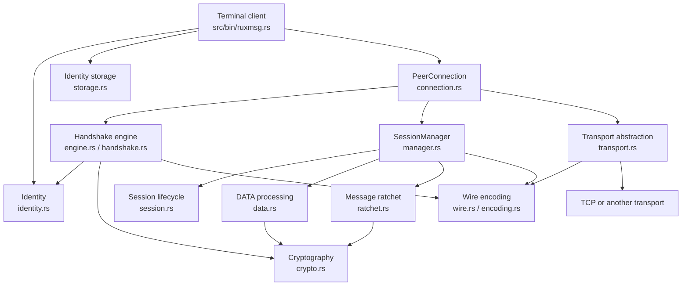

# RUXMSG architecture

This document explains how the RUXMSG implementation is organized. It is **explanatory, not normative**.

For wire behavior, protocol requirements, and security-critical interoperability rules, see the [RUXMSG/1 protocol specification](protocol-spec.md).

---

## System boundary

RUXMSG is a peer-to-peer encrypted messaging library with a terminal client.

The protocol treats the underlying network as hostile. TCP, Tailscale, or another transport provides **reachability and byte delivery only**. Cryptographic identity, peer authentication, session establishment, confidentiality, integrity, replay protection, and message-key evolution are implemented above the transport layer.



The important architectural boundary is:

```text
Application / CLI
       │
       ▼
Connection + session management
       │
       ├── Handshake
       ├── Session lifecycle
       ├── Ratchet
       └── DATA protection
       │
       ▼
Wire framing / CBOR
       │
       ▼
Transport
       │
       ▼
Network
```

The network does not establish RUXMSG identity.

---

## Module responsibilities

### Identity

`identity.rs` contains the protocol's identity abstractions.

The local identity is based on a persistent Ed25519 signing key. Peer identities are represented by their authenticated public identity information.

The long-term identity key is used for authentication during the handshake. It is **not** used directly as the symmetric key protecting application DATA.

The identity boundary is deliberately separate from active session state.

---

### Persistent storage

`storage.rs` defines the persistence boundary used by the application.

The current implementation persists the **local Ed25519 identity seed** through an operating-system credential-store abstraction.

The storage layer does not currently implement a persistent trusted-peer database or sealed trust file.

The current persistence model is therefore:

```text
OS credential store
        │
        └── local Ed25519 identity seed
```

The following protocol state remains in memory:

* peer session state;
* ephemeral X25519 private keys;
* session keys;
* ratchet chains;
* message keys;
* replay state;
* skipped-key state;
* session lifecycle state;
* SAS approval state;
* trusted-peer state.

A successful SAS verification therefore authenticates the current connection, but the current implementation does not persist that approval for automatic reuse on a future connection.

---

## Handshake architecture

The handshake is split between protocol data structures and the engine that drives the exchange.

### `handshake.rs`

`handshake.rs` defines the handshake messages and associated protocol structures.

The handshake carries the information required to establish and authenticate a fresh session, including:

* persistent peer identity;
* ephemeral X25519 public key;
* role information;
* handshake nonce material;
* protocol purpose/context;
* authentication data;
* confirmation data.

### `engine.rs`

`engine.rs` drives the blocking handshake over a `Transport`.

The handshake flow is conceptually:

```text
Local identity
      │
      ├── generate fresh ephemeral X25519 key
      │
      ▼
Exchange handshake information
      │
      ▼
Construct deterministic transcript
      │
      ├── transcript hash
      │
      ├── SAS
      │
      └── Ed25519 authentication
      │
      ▼
Derive shared session material
      │
      ├── X25519
      └── HKDF-SHA-256
      │
      ▼
Exchange confirmation MACs
      │
      ▼
Established session
```

The transcript binds the relevant handshake inputs together before authentication.

The signatures authenticate the transcript rather than being included as inputs to the transcript being signed. This prevents the authentication operation itself from changing the value being authenticated.

The handshake does not consider the session established merely because the key exchange completed. Confirmation must also succeed.

---

## SAS verification

The handshake derives a short authentication string from the authenticated session context.

The terminal client displays this SAS during first contact and requires the user to compare it with the peer through an independent channel.

Conceptually:

```text
Peer A                           Peer B
  │                                │
  │──── authenticated handshake ──►│
  │                                │
  │        derive SAS               │
  │                                │
  │◄──────── compare ──────────────►│
  │                                │
  │──── confirmation exchange ─────►│
  │                                │
  └──────── established ────────────┘
```

A matching SAS provides the human-verifiable binding between the authenticated cryptographic identities and the intended peer.

The library exposes SAS approval through the handshake interface. The current CLI does not maintain a persistent trust database, so SAS verification is performed again for a newly established connection.

---

## Cryptographic composition

RUXMSG deliberately separates long-term identity keys from ephemeral session keys.

The primary cryptographic roles are:

| Purpose                        | Primitive                                |
| ------------------------------ | ---------------------------------------- |
| Persistent peer identity       | Ed25519                                  |
| Ephemeral key agreement        | X25519                                   |
| Session/key derivation         | HKDF-SHA-256                             |
| DATA encryption/authentication | ChaCha20-Poly1305                        |
| Handshake/session confirmation | MAC construction defined by the protocol |

The high-level relationship is:

```text
Ed25519
   │
   └── authenticates handshake transcript

X25519
   │
   └── establishes fresh shared secret

HKDF-SHA-256
   │
   └── derives session and directional key material

Ratchet
   │
   └── derives evolving message keys

ChaCha20-Poly1305
   │
   └── protects individual DATA messages
```

`crypto.rs` contains the cryptographic composition and supporting key/nonce derivation helpers.

---

## Session architecture

`manager.rs` owns active session management.

`session.rs` models session lifecycle and state transitions.

The active connection is organized around an established cryptographic session rather than treating the TCP connection itself as the security boundary.

This distinction matters because:

```text
TCP connection
    ≠
RUXMSG cryptographic session
```

A transport connection provides the channel over which a RUXMSG session is established. Cryptographic state belongs to the RUXMSG session.

---

## Ratchet and DATA processing

`ratchet.rs` maintains directional message-key state.

The ratchet provides:

* evolving message-key material;
* replay protection;
* bounded out-of-order message handling;
* skipped-key tracking;
* limits on retained skipped keys.

`data.rs` handles application DATA processing.

The DATA path conceptually performs:

```text
Application bytes
      │
      ▼
Padding
      │
      ▼
Message-key derivation
      │
      ▼
ChaCha20-Poly1305
      │
      ▼
Authenticated DATA frame
```

On receipt, the process is reversed:

```text
Authenticated DATA frame
      │
      ▼
Replay / sequence validation
      │
      ▼
Message-key lookup or derivation
      │
      ▼
ChaCha20-Poly1305 verification
      │
      ▼
Padding validation/removal
      │
      ▼
Application bytes
```

Only authenticated DATA is exposed to the application.

---

## Rekey and draining

RUXMSG supports session lifecycle transitions that allow a new session to replace an older one.

During a rekey transition, the session manager can maintain:

```text
Active session
      │
      │ rekey
      ▼
New active session

Previous session
      │
      └── draining
              │
              └── accepts eligible in-flight DATA
```

The active session is responsible for originating new DATA.

A draining predecessor may continue accepting eligible in-flight DATA during its defined drain period, but it does not originate new application DATA.

This prevents a rekey transition from requiring the transport itself to disappear before the previous cryptographic state can be retired.

---

## Wire architecture

`wire.rs` implements the outer RUXMSG frame.

The frame consists of a six-byte header followed by the payload:

```text
+---------+---------+----------------+-------------------+
| Version |  Type   | Payload Length |      Payload      |
+---------+---------+----------------+-------------------+
| 1 byte  | 1 byte  |    4 bytes     | N bytes           |
+---------+---------+----------------+-------------------+
```

The wire layer is responsible for:

* frame encoding;
* frame decoding;
* version validation;
* message-type handling;
* payload-length validation;
* payload-size limits;
* rejecting malformed frames.

The frame boundary is intentionally independent of the underlying stream.

A TCP read is not assumed to correspond to exactly one RUXMSG frame.

For example:

```text
TCP read #1
    └── partial frame

TCP read #2
    └── remainder of frame + beginning of next frame

TCP read #3
    └── remainder of next frame
```

The framing layer reconstructs complete protocol frames from the stream.

---

## CBOR and encoding

`encoding.rs` contains protocol encoding helpers.

Structured protocol payloads use CBOR according to the normative protocol rules.

The implementation validates the encoded representation rather than treating arbitrary successfully parsed CBOR as automatically acceptable.

Validation includes the protocol's requirements concerning:

* canonical encoding;
* supported fields;
* unknown fields;
* duplicate fields/keys;
* trailing bytes;
* expected payload structure.

This keeps encoding rules at the protocol boundary instead of scattering wire-format assumptions throughout the session implementation.

---

## Transport architecture

`transport.rs` defines the transport abstraction used by the protocol.

The core abstraction allows the handshake and session machinery to operate without depending directly on TCP.

The current transport components include:

### `Transport`

The transport boundary used by the handshake and connection layers.

It provides the protocol with a mechanism for sending and receiving framed messages without requiring the higher layers to know how the bytes are physically delivered.

### `InMemoryTransport`

An in-memory transport implementation used primarily for deterministic testing.

It allows protocol behavior to be exercised without creating real network sockets.

### `FramedTransport<S>`

A generic framed transport over a stream implementing the appropriate `Read + Write` interfaces.

This is the bridge between the protocol's frame abstraction and ordinary byte streams such as TCP sockets.

### `Demuxer<T>`

The demultiplexing layer handles frames that arrive while a higher-level control exchange is waiting for a particular frame type.

For example, DATA or CLOSE frames can arrive while a handshake/rekey operation is waiting for control traffic. The demuxer provides the buffering/routing needed to keep those frames from being incorrectly consumed as handshake messages.

---

## Connection API

`connection.rs` provides the high-level `PeerConnection<T>` facade.

It combines transport, handshake, session, DATA, rekey, and close behavior into a single connection-oriented API.

Conceptually:

```text
PeerConnection<T>
      │
      ├── Transport
      ├── Handshake
      ├── Active session
      ├── DATA send/receive
      ├── Rekey
      ├── Drain
      └── Close
```

The connection abstraction is generic over its transport where supported by the API.

This allows the same protocol machinery to be exercised against:

* in-memory transports;
* framed streams;
* TCP-backed transports;
* future transport implementations.

---

## TCP connection splitting

The TCP implementation provides a split API through `split_tcp()`.

This separates reader/rekey activity from writer/close activity.

Conceptually:

```text
                 TCP socket
                    │
          ┌─────────┴─────────┐
          │                   │
          ▼                   ▼
 Reader / rekey            Writer / close
     half                     half
          │                   │
          └──── shared session ────┘
```

The reader owns socket reads.

The writer uses the synchronized write side needed to allow outgoing operations while the reader may be blocked waiting for peer input.

The split API exists to avoid requiring one synchronous operation to monopolize the entire connection.

Callers must still respect the session-state ownership rules of the API. Operations that mutate shared cryptographic/session state must not be performed concurrently in ways that bypass those guarantees.

---

## Terminal client architecture

The terminal application is implemented in:

```text
src/bin/ruxmsg.rs
```

The current client is a **line-oriented multi-session REPL**.

It is not the older one-shot:

```text
ruxmsg listen ...
ruxmsg connect ...
```

model.

The process maintains multiple peer/session handles and allows the user to interact with individual sessions from the REPL.

The current command families include:

```text
profile init <name>
profile use <name>
profile list

start [--addr <addr>]
stop
connect <addr>

peers
use <label>
msg <label> <text>
close <label>

fingerprint [label]
session <label>

tailscale status
tailscale up
tailscale ip

help
quit
```

The CLI therefore sits above the library rather than defining the protocol itself.

Conceptually:

```text
                    ruxmsg REPL
                        │
             ┌──────────┴──────────┐
             │                     │
        Profile/identity       Peer sessions
             │                     │
             ▼                     ▼
          Storage            PeerConnection
                                   │
                     ┌─────────────┴─────────────┐
                     ▼                           ▼
                Handshake                    Session
                     │                           │
                     └───────────┬───────────────┘
                                 ▼
                              Transport
                                 │
                                 ▼
                                TCP
```

The client currently supports multiple simultaneous connections within one process.

---

## Profiles

The CLI supports named profiles.

A profile identifies the local identity context used by the client. Profile selection is an application-level concept and does not change the protocol's cryptographic rules.

The profile boundary is useful for keeping multiple local identities separate:

```text
ruxmsg
  │
  ├── profile alice
  │      └── Alice's persistent identity
  │
  ├── profile bob
  │      └── Bob's persistent identity
  │
  └── ...
```

Identity persistence is handled through the storage abstraction rather than by exposing private key material directly to the REPL.

---

## Tailscale integration

Tailscale is optional.

The CLI can interact with the `tailscale` command when it is available, primarily for convenience when discovering or configuring network reachability.

Tailscale does not replace the RUXMSG identity or authentication model.

The security relationship is:

```text
Tailscale
    │
    └── reachability

RUXMSG
    │
    ├── Ed25519 identity
    ├── authenticated handshake
    ├── SAS
    ├── session keys
    └── encrypted DATA
```

A peer reachable through Tailscale is not automatically trusted by RUXMSG.

---

## State and persistence boundary

RUXMSG intentionally separates persistent local identity from ephemeral cryptographic session state.

### Persistent

The current implementation persists:

* local Ed25519 identity seed;
* profile-associated identity information required to recover that identity.

Persistence is provided through the operating-system credential-store abstraction.

### In memory

The current implementation keeps the following state in memory:

* ephemeral X25519 private keys;
* handshake state;
* peer session state;
* session keys;
* directional ratchet state;
* message keys;
* replay state;
* skipped keys;
* active/draining session state;
* SAS approval state;
* active peer connections.

### Not currently persisted

The current implementation does **not** persist:

* trusted-peer records;
* trusted-peer SAS approvals;
* message history;
* conversation state;
* active sessions;
* ratchet state;
* message keys.

Consequently, restarting the process requires establishing fresh cryptographic sessions.

The persistent Ed25519 identity survives the restart, but the cryptographic session does not.

---

## Restart behavior

Identity persistence and session persistence are intentionally separate.

A restart has the following conceptual behavior:

```text
Before restart:

Persistent identity
       │
       ├── active session
       ├── ratchet state
       └── message state


Process exits


After restart:

Persistent identity
       │
       └── fresh handshake
                │
                ▼
          fresh session
```

The local identity can therefore remain stable across application restarts while session keys and ratchet state are regenerated.

A transport reconnect is likewise not equivalent to resuming an existing cryptographic session. A newly established connection performs the protocol's session-establishment process rather than silently inheriting stale session state.

---

## Error and validation boundaries

RUXMSG keeps validation close to the layer responsible for the relevant invariant.

Examples:

* `wire.rs` validates frame structure and limits;
* `encoding.rs` validates protocol encoding;
* `handshake.rs` and `engine.rs` validate handshake state and authentication;
* `ratchet.rs` validates message-key/replay state;
* `session.rs` validates lifecycle transitions;
* `connection.rs` coordinates the higher-level operation.

This separation is important because malformed network input should be rejected before it can become trusted application state.

---

## Testing architecture

The repository uses multiple layers of testing.

### Unit-level behavior

Individual modules contain tests for local invariants and cryptographic/session behavior.

### Integration tests

The `tests/` directory exercises interactions between protocol components, including:

```text
tests/
├── conformance.rs
├── connection.rs
├── handshake.rs
├── rekey.rs
├── restart.rs
├── tcp_split.rs
└── transport.rs
```

These tests cover areas including:

* handshake establishment;
* connection behavior;
* transport framing;
* TCP stream splitting;
* session restart behavior;
* rekeying;
* protocol conformance.

### In-memory protocol testing

`InMemoryTransport` allows protocol behavior to be tested without depending on an external network.

This is particularly useful for deterministic handshake, session, and failure-path testing.

### Fuzzing

The repository also contains fuzzing infrastructure for exercising protocol parsing and boundary conditions.

The purpose is to find cases where malformed or unexpected input can violate assumptions made by the wire, encoding, or protocol layers.

---

## Architectural invariants

Several boundaries are intentionally maintained throughout the implementation.

### Network identity is not cryptographic identity

```text
IP address / hostname / Tailscale address
        ≠
RUXMSG peer identity
```

### Long-term identity keys are not message keys

```text
Ed25519 identity key
        ≠
session encryption key
        ≠
individual message key
```

### Transport state is not session state

```text
TCP connection
        ≠
RUXMSG session
```

### Persistence is not session resumption

```text
persistent identity
        ≠
persistent ratchet/session state
```

### Authentication is not automatic trust persistence

A successfully authenticated handshake and SAS comparison establish the current connection. The current implementation does not convert that event into a persistent trusted-peer record.

---

## Cross-platform architecture

The core library uses Rust's portable standard-library abstractions and does not depend on Linux-specific socket APIs, Windows-specific networking APIs, or macOS-specific networking frameworks.

The transport abstraction is intentionally generic, while the terminal client relies on cross-platform Rust facilities for TCP and credential storage.

The current platform-specific boundary is primarily the operating-system credential store used by the identity persistence layer.

The repository's automated CI currently validates Linux. The architecture is intended to support other platforms, but macOS and Windows are not currently represented by dedicated CI jobs.

---

## Design philosophy

RUXMSG is structured around explicit boundaries:

```text
Identity
   │
   ▼
Handshake
   │
   ▼
Session
   │
   ▼
Ratchet / DATA
   │
   ▼
Wire
   │
   ▼
Transport
   │
   ▼
Network
```

Each layer has a narrow responsibility.

The protocol does not depend on the terminal UI, the terminal UI does not define cryptographic behavior, and the transport does not define peer identity.

This makes the protocol implementation usable independently of the current CLI and allows deterministic testing without requiring a real network.

The architecture is intentionally conservative: cryptographic state is explicit, session transitions are modeled, wire input is validated at the boundary, and persistent state is limited to what the current implementation actually needs.

For normative behavior, the [protocol specification](protocol-spec.md) takes precedence over this document.
